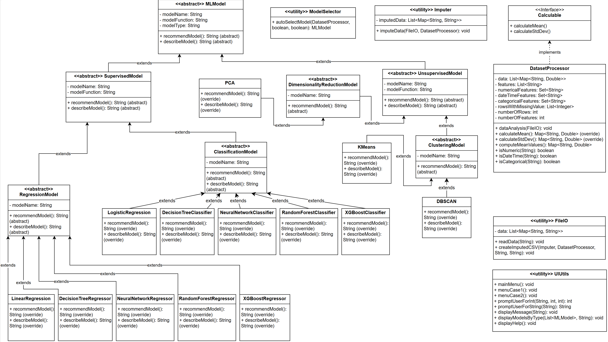
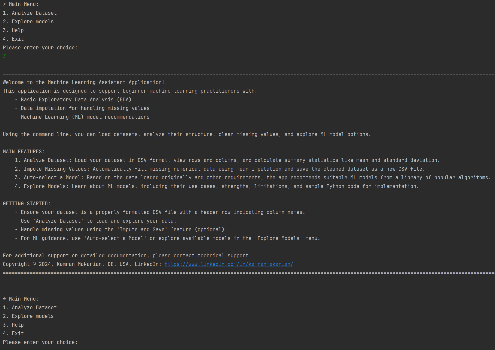

# Machine Learning Assistant Application

**Description**  
A Java-based command-line tool that supports beginner machine learning practitioners with:
- Basic Exploratory Data Analysis (EDA)
- Data imputation for missing values
- ML model recommendations and exploration

## Who Is This For?

- **Data Science Beginners**  
  As a beginner data scientist, I want an easy way to load a CSV dataset and run basic analysis so that I can quickly understand the data without writing a lot of code.

- **Machine Learning Beginners**  
  As a beginner ML practitioner, I want to see which algorithms best fit my data so that I can try them out in my experiments.

## Features
- **Analyze Dataset**: Load CSV, view summary statistics (mean, std dev, etc.).
- **Impute Missing Values**: Automatically fill missing numerical data (mean).
- **Auto-select a Model**: Get recommended ML algorithms based on your data.
- **Explore Models**: Learn about different ML algorithms and sample code in Python.

## Design


## Demo
Below is a screenshot of the main menu interface:



## Getting Started

### Prerequisites
- Java 8 or higher
- Maven 3.x (if you plan to build via Maven)

### Clone this repository:
   ```bash
   git clone https://github.com/KamranMakarian/ML_Modeling_Assistant_App.git
   ```

## Usage
- Analyze Dataset: Type 1 in the main menu, provide a CSV filepath, and explore summary stats.
- Impute Missing Values: Type 2, the program will automatically fill missing values.
- Auto-select a Model: Type 3, the program will recommend best-fit algorithms based on loaded data.
- Explore Models: Type 4, learn about different ML algorithms, pros/cons, and get sample Python code.

## Folder Structure
```css
ML_Modeling_Assistant_App/
  ├── data/
  ├── design/
  ├── src/
  │   └── main/
  │       └── java/
  │           └── org/example/...
  ├── pom.xml
  └── ...
```
- `src/main/java/org/example`: Core Java source files for the command-line application.
- `data`: (Optional) Sample or test CSV files.
- `design`: UML diagrams, flowcharts, or design documents (if any).

## Contact / Author
- **Author**: Kamran Makarian
- **LinkedIn**: https://www.linkedin.com/in/kamranmakarian/
- If you need help, open an issue.


